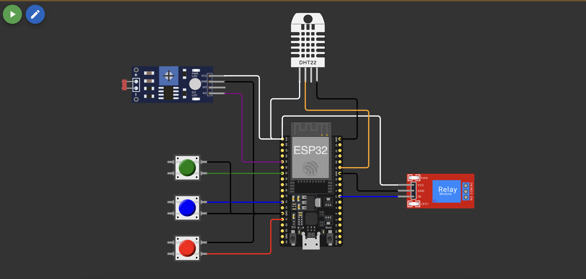

# Sistema de Irrigação Inteligente para Cultivo de Café

## Change log
- Ajuste na lógica de gestão dos botões para simular a injeção de nutrientes N P K mediante inversão de estados, ou seja, se há deficiência de nutrientes, o acionamento supre a deficiência. Após novo acionamento, o estado se inverte, alertando novamente para a falta do nutriente.
- Remoção de lógica de gestão de temperatura visto que não consta na demanda original.
- Redução de refreshing de leitura para 1 segundo.

## Visão Geral do Projeto
Este projeto implementa um sistema de irrigação automatizado para o cultivo de café, utilizando um ESP32 para monitorar e controlar diversos parâmetros cruciais para o desenvolvimento saudável da plantação. O sistema integra múltiplos sensores para monitorar nutrientes (NPK), pH do solo e umidade, tomando decisões automatizadas sobre a irrigação com base nas condições ideais para o cultivo do café.

## Requisitos do Sistema

### Hardware
- ESP32 DevKit
- 3 Botões (simulando sensores NPK)
- Sensor LDR (simulando sensor de pH)
- Sensor DHT22 (monitoramento de umidade)
- Módulo Relé (controle da bomba d'água)

### Conexões dos Componentes



**Detalhamento das Conexões:**

- **Botões NPK:**
  - Botão N: GPIO32
  - Botão P: GPIO14
  - Botão K: GPIO13
  - Todos com pull-up e conectados ao GND

- **Sensor pH (LDR):**
  - Pino analógico: GPIO34
  - VCC: 3.3V
  - GND: GND

- **Sensor DHT22:**
  - Pino de dados: GPIO21
  - VCC: 3.3V
  - GND: GND

- **Relé da Bomba:**
  - Pino de controle: GPIO17
  - VCC: 3.3V
  - GND: GND

## Parâmetros Ideais para Cultivo do Café

### Condições Monitoradas

1. **pH do Solo**
   - Faixa ideal: 5.5 a 6.5
   - Monitoramento através do sensor LDR
   - Valores convertidos para escala de pH (0-14)
   - Crucial para absorção adequada de nutrientes

2. **Umidade do Solo**
   - Faixa ideal: 60% a 80%
   - Monitorado pelo sensor DHT22
   - Sistema de irrigação ativa quando < 60%
   - Prevenção de irrigação excessiva > 80%

3. **Nutrientes (NPK)**
   - Nitrogênio (N): Crescimento vegetativo
   - Fósforo (P): Desenvolvimento das raízes
   - Potássio (K): Qualidade dos frutos
   - Monitoramento binário (presente/ausente)

## Lógica de Funcionamento

### Sistema de Irrigação
1. **Coleta de Dados**
   - Leitura contínua de todos os sensores
   - Intervalo de 1 segundo entre leituras
   - Conversão de valores analógicos para escalas apropriadas

2. **Análise de Condições**
   - Verificação de todos os parâmetros
   - Comparação com valores ideais
   - Geração de alertas quando necessário

3. **Tomada de Decisão**
   - Irrigação ativada se umidade < 60%
   - Consideração do estado de nutrientes
   - Monitoramento do pH para ajustes

### Sistema de Alertas
- Indicação de pH fora da faixa ideal
- Alertas de umidade inadequada
- Notificação de deficiências de nutrientes

## Implementação

### Estrutura do Código
- Modular e organizado em funções específicas
- Sistema de monitoramento contínuo
- Lógica de decisão baseada em parâmetros científicos
- Interface serial para debug e monitoramento

### Principais Funções
```cpp
DadosSensores lerSensores()
// Coleta dados de todos os sensores e retorna estrutura unificada

StatusSistema verificarCondicoesCafe()
// Analisa condições e determina necessidade de irrigação

void imprimirStatus()
// Exibe informações no monitor serial
```

## Monitoramento
- Display contínuo de leituras no monitor serial
- Atualização a cada 1 segundo
- Exibição de todos os parâmetros monitorados
- Sistema de alertas em tempo real

## Demonstração
https://youtu.be/dFZmQBdduao

## Colaboradores Grupo 9
Erik Criscuolo, Daniel Emilio Baião, 
Marcus Vinícius Loureiro Garcia,
Sidney William de Paula Dias, Hugo Rodrigues Carvalho Silva